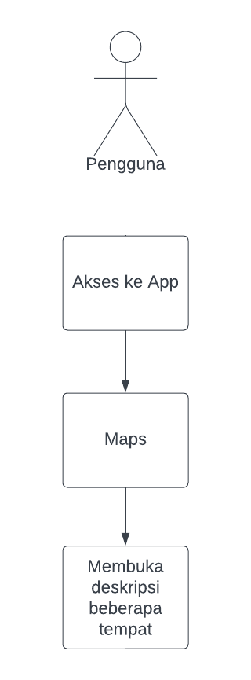

# Mobile Apps SIG Desa Panongan

## Business Domain
Mobile App SIG Desa

## Business Process
Informasi sistem geografis desa Panongan

## Introduction
Aplikasi Mobile SIG Desa dirancang untuk memberikan akses informasi geografis bagi masyarakat dan pihak terkait di wilayah Desa Panongan. Aplikasi ini menyediakan peta interaktif dan deskripsi lokasi penting seperti sekolah, kantor desa, fasilitas kesehatan, tempat ibadah, dan area publik lainnya.

## Objective
Mempermudah pengguna dalam menemukan lokasi dan informasi detail mengenai tempat tersebut.

## Scope
- **Batasan**: Tidak ada batasan akses.
- **Kriteria**: Pengguna mendapatkan informasi lokasi dan deskripsi detail setiap tempat.

## Business Requirements
### Definition
- **Produk**: Aplikasi Mobile SIG Desa

- **Layanan**: Layanan Informasi

- **Definisi**: Aplikasi Mobile SIG Desa adalah sebuah solusi berbasis mobile yang berfungsi untuk memberikan akses mudah ke data geografis desa bagi pengguna di segala kalangan. Aplikasi ini menyediakan informasi tentang lokasi-lokasi penting dan fasilitas umum di wilayah desa Panongan, seperti sekolah, kantor kepala desa, fasilitas kesehatan, area publik, dan titik layanan lainnya.

- **Abstrak**: Dalam era digital yang berkembang pesat, kebutuhan akan informasi geografis yang dapat diakses secara langsung menjadi semakin penting, terutama di tingkat desa. Aplikasi Mobile SIG Desa dikembangkan untuk menjawab kebutuhan ini, memungkinkan pengguna di segala kalangan dapat mengakses data lokasi dan peta wilayah desa. Aplikasi ini tidak hanya memfasilitasi masyarakat dalam menemukan lokasi strategis di desa, tetapi juga memberikan platform bagi pemerintah desa untuk mengelola dan menyebarkan informasi wilayah secara efisien. Fitur utama dalam aplikasi ini meliputi peta interaktif, serta informasi deskriptif tentang beberapa lokasi.

## Fungsi Teknis
1. **Maps Interaktif**: Fitur ini berisi informasi terkait geografis melalui maps atau peta
2. **Informasi Deskriptif Lokasi**: Fitur ini berisi penjelasan singkat mengenai setiap tempat dan fungsinya.

## Fungsi Strategis
1. **Kinerja**: Pada aplikasi ini dapat memberikan solusi kepada pengguna untuk informasi terkait geografis wilayah desa panongan melalui maps atau peta dan penjelasan singkat setiap tempat dan fungsinya.
2. **Keunggulan**: Desain interface yang sederhana membuat para pengguna dapat dengan mudah mengetahui informasi terkait geografis dan penjelasannya.

## Flow Diagram
- **Proses:**

1. Pengguna membuka aplikasi
2. Sistem menampilkan maps bagian desa Panongan
3. Pengguna dapat melihat maps bagian desa Panongan
4. Sistem menampilkan deskripsi lokasi atau tempat di desa Panongan
5. Pengguna dapat melihat deskripsi lokasi atau tempat di desa Panongan

## Spesifikasi
1.	Menggunakan Framework Flutter
2.	Menambahkan Maps
    - Menambahkan maps memakai package flutter_map versi 4.0.0 (yang didasarkan pada OpenStreetMap) dan memakai package latlong2 versi 0.8.1

- flutter_map
    - Paket untuk menambahkan peta interaktif ke aplikasi Flutter. Paket ini mendukung berbagai jenis peta, termasuk OpenStreetMap yang saya pakai. Dan sangat berguna untuk menampilkan lokasi dan informasi geografis, cocok untuk studi kasus yang saya kerjakan

- latlong2
    - Paket yang menyediakan tipe data dan fungsi untuk bekerja dengan titik koordinat geografis, yaitu latitude (garis lintang) dan longitude (garis bujur).

Package flutter_map dan latlong2 sering digunakan bersama untuk menentukan lokasi titik pada peta dan melakukan perhitungan terkait jarak dan arah.
